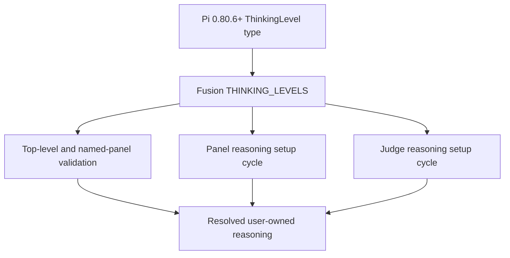
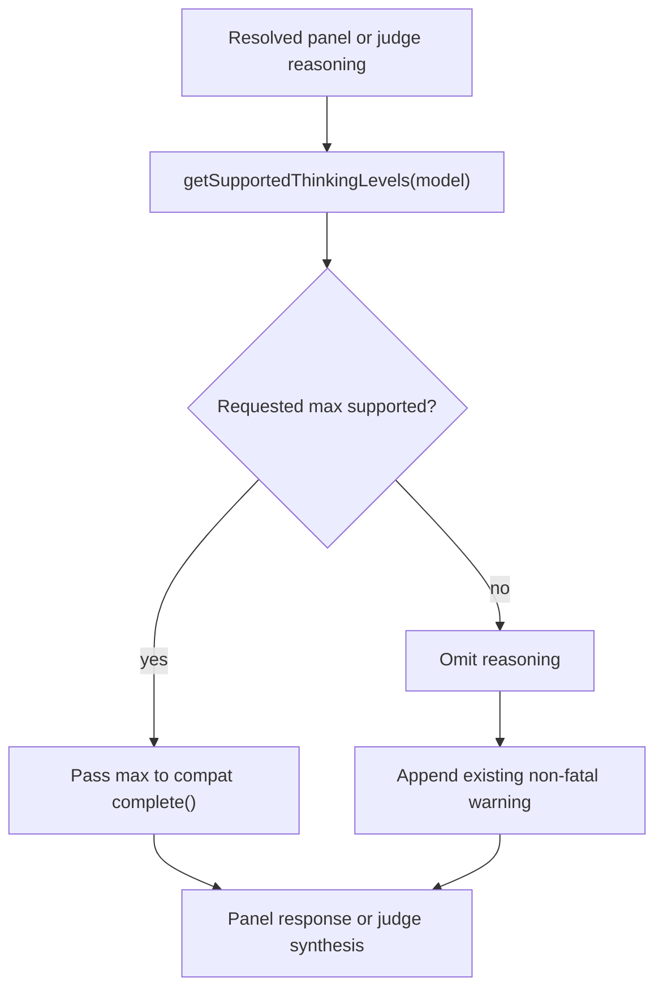

# Max Thinking Level Support - Plan

## Goal Capsule

| Field | Value |
|---|---|
| Objective | Resolve GitHub issue #19 by accepting Pi's `max` thinking level for panel and judge reasoning while preserving user ownership and per-model fallback behavior. |
| Authority | Issue #19, Pi 0.80.6 public contracts, repository instructions, then current Fusion reasoning patterns. |
| Execution profile | Small public-contract change protected by configuration, runtime, type, package, and live extension verification. |
| Stop conditions | Stop if the Pi 0.80.6 compatibility entrypoint cannot preserve the existing completion behavior or if the change would expose reasoning control to the invoking model. |
| Tail ownership | The executor owns implementation and verification; version bumps, changelog entries, tags, and release publication remain outside this plan. |

---

## Product Contract

### Summary

Accept lowercase `max` anywhere users can configure panel or judge reasoning, expose it through the existing setup controls, and dispatch it only to models that report support.
Align the package with the first Pi release that can type and execute `max` without expanding the model-controlled tool surface.

### Problem Frame

Pi added `max` to its provider-neutral `ThinkingLevel`, but Fusion's runtime validation stops at `xhigh`.
Users can select a `:max` model in Pi yet cannot apply the same effort to `panelReasoning` or `judgeReasoning`; the configuration is rejected before Fusion reaches its existing per-model capability guard.

The checkout is also locked to Pi 0.79.3, whose type and capability ladder cannot represent `max`.
Effective support therefore requires the Pi 0.80.6 contract rather than a local parsing-only shim that would always omit the requested level at dispatch.

### Requirements

**Configuration and setup**

- R1. Top-level and named-panel `panelReasoning` and `judgeReasoning` accept the exact lowercase value `max`.
- R2. Both `/fusion-setup` reasoning controls cycle from `xhigh` to `max` through the same shared ordered vocabulary used by configuration validation.
- R3. Earlier reasoning values and generated configuration defaults remain unchanged, while values such as `MAX` and `maximum` remain invalid.

**Runtime behavior and control**

- R4. A panel model or judge that reports `max` support receives `max`; an unsupported model receives no requested reasoning and produces the existing non-fatal warning without clamping.
- R5. Reasoning remains user-owned configuration and is not added to the registered `fusion` tool parameters.

**Compatibility and documentation**

- R6. Package metadata and the reproducible install baseline require aligned Pi peers at 0.80.6 or newer, the first release line whose public type and runtime capability logic include `max`.
- R7. The README lists `max`, the new Pi minimum, unchanged unsupported-model behavior, and the existing latency/token/cost warning.

### Acceptance Examples

- AE1. Given top-level `panelReasoning: "max"` and `judgeReasoning: "max"`, effective configuration preserves both values without warnings.
- AE2. Given a named panel with `judgeReasoning: "max"` and an omitted panel override, the named panel preserves `max` for the judge and inherits the top-level panel value.
- AE3. Given a mixed panel where one model reports `thinkingLevelMap.max` and another does not, the supported model receives `max`, the unsupported model records no effective level, and Fusion returns the existing model-specific warning.
- AE4. Given fewer than two successful panel responses, judge synthesis is skipped and a requested judge `max` produces neither a provider call nor a support warning.

### Scope Boundaries

- Do not redesign reasoning configuration, introduce per-model config objects, clamp unsupported levels, or filter setup choices against the currently selected models.
- Do not migrate Fusion from Pi's temporary compatibility completion API to the newer `Models` runtime in this issue.
- Do not add reasoning overrides to the model-controlled `fusion` tool schema.
- Do not change generated template defaults merely to demonstrate `max`.
- Do not add a changelog entry, bump the Fusion version, tag, publish, or perform other release work.

### Sources and Research

- [GitHub issue #19](https://github.com/synthetic-recon/pi-fusion/issues/19) defines the requested behavior and identifies the existing validation boundary.
- [Pi v0.80.6](https://github.com/earendil-works/pi/releases/tag/v0.80.6) is the first published release whose `ThinkingLevel` type and runtime capability ladder include `max`.
- [Pi AI 0.80 migration notes](https://github.com/earendil-works/pi/blob/v0.80.6/packages/ai/CHANGELOG.md) place legacy `complete()` and faux-provider registration under `@earendil-works/pi-ai/compat`.
- [Current Pi AI types](https://github.com/earendil-works/pi/blob/main/packages/ai/src/types.ts) and [CLI validation](https://github.com/earendil-works/pi/blob/main/packages/coding-agent/src/cli/args.ts) confirm `max` but expose no universal runtime level list.
- `docs/plans/2026-07-10-001-feat-fusion-profiles-reasoning-status-plan.md` records the user-owned reasoning and warn-without-clamping contracts this plan preserves.
- No `CONCEPTS.md` or `docs/solutions/` corpus exists, so there are no repository solution notes to carry forward.

---

## Planning Contract

### Key Technical Decisions

- KTD1. Keep one Fusion-owned ordered thinking-level allowlist and append `max` after `xhigh`. (session-settled: user-approved — chosen over a new synchronization abstraction: Pi exposes a model-specific support query but no stable universal runtime list for pre-model configuration and setup.)
- KTD2. Raise the aligned `@earendil-works/pi-ai`, `@earendil-works/pi-coding-agent`, and `@earendil-works/pi-tui` peer minimums to 0.80.6 and refresh the lockfile.
  `pi-ai` owns the reasoning contract, `pi-coding-agent` supplies the registry/runtime model objects, and `pi-tui` crosses the coding-agent UI boundary, so moving the established compatibility line together avoids an untested mixed Pi graph.
- KTD3. Import only `complete` and `registerFauxProvider` from `@earendil-works/pi-ai/compat`; keep `getSupportedThinkingLevels`, model/message types, `fauxAssistantMessage`, and `fauxToolCall` on the root import.
  Pi 0.80 made this split a breaking package boundary, while a full migration to the new provider runtime is outside the issue.
- KTD4. Continue using `getSupportedThinkingLevels(model)` at dispatch time and omit unsupported effort rather than calling Pi's clamp helper.
  Configuration and setup exist before a specific model is resolved, while dispatch is the correct point for model-specific capability checks.
- KTD5. Preserve the registered tool schema unchanged.
  Reasoning changes cost, latency, and quality, so the invoking model must not override user-owned panel or judge settings.

### High-Level Technical Design

The shared vocabulary remains the single pre-model source for configuration and setup:

Runtime support stays model-specific and preserves the current failure mode:

### System-Wide Impact

| Surface | Planned effect | Invariant |
|---|---|---|
| Config validation | Accept `max` at top level and in named panels. | Invalid values still fail or warn through existing paths. |
| Setup UI | Both reasoning rows gain `max` through the shared sequence. | Session snapshot and custom-selection behavior remain unchanged. |
| Panel execution | Resolve support independently for every model. | Mixed panels continue after unsupported requests with deterministic warnings. |
| Judge execution | Apply the same support guard only when synthesis runs. | A skipped judge produces no call and no judge-support warning. |
| Tool schema | No new reasoning input. | Panel, judge, reasoning, tools, and budgets remain user-owned. |
| Package compatibility | Move to aligned Pi 0.80.6+ peers and the compatibility completion entrypoint. | Keep `dependencies: {}` and avoid a broader provider-runtime migration. |

### Risks and Dependencies

- **Pi's compatibility entrypoint is explicitly transitional.** Keep the import migration narrow, verify minimum and current Pi releases, and defer the larger `Models` migration to separate work.
  Retain the repository's established open-ended peer policy consciously: minimum/current checks cover known releases, while removal of `/compat` in a future admitted release is the boundary that triggers the separate migration rather than an assurance this plan can make in advance.
- **A global `max` choice is not universal model support.** Preserve per-model resolution and cover both supported and unsupported paths so the UI does not imply silent clamping.
- **Raising the peer floor drops older Pi installations.** Document the new minimum and use 0.80.6 because earlier releases cannot fulfill the feature's public type or effective runtime contract.
- **The shared allowlist can drift if Pi adds another level.** Keep it adjacent to the imported `ThinkingLevel` contract, test its ordered contents, and avoid importing private CLI constants.

---

## Implementation Units

### U1. Align the Pi compatibility baseline

- **Goal:** Establish a type-correct and runtime-compatible Pi 0.80.6+ baseline before adding `max`.
- **Requirements:** R6, R7; KTD2, KTD3
- **Dependencies:** None
- **Files:** `package.json`, `package-lock.json`, `src/llm.ts`, `src/__tests__/llm.test.ts`, `README.md`
- **Approach:**
  1. Raise all three Pi peer minimums together and refresh the reproducible peer resolution while keeping the package dependency-free.
  2. Split the legacy completion import and faux-provider test registration onto Pi's compatibility entrypoint, leaving model types and capability helpers on the root API.
  3. Update the documented Pi minimum without changing Fusion's version or changelog.
- **Execution note:** Prove extension loading and the existing LLM tests against the new import boundary before changing the reasoning vocabulary.
- **Patterns to follow:** The aligned Pi peer ranges in `package.json`; the documented Pi API import boundaries; the current fake-provider test lifecycle.
- **Test scenarios:**
  1. Loading the extension with aligned Pi 0.80.6 peers resolves both the root API and `/compat` entrypoint without an export error.
  2. The existing raw-completion and faux-provider tests behave unchanged after the import split.
  3. Type checking sees `max` in Pi's exported `ThinkingLevel`.
  4. The package manifest still has an empty `dependencies` object and aligned peer minimums.
- **Verification:** The extension loads, existing focused LLM tests pass, and package/type checks report no compatibility regression before U2 begins.

### U2. Accept and dispatch max reasoning

- **Goal:** Add `max` to every user-owned reasoning surface and prove supported and unsupported runtime behavior.
- **Requirements:** R1, R2, R3, R4, R5, R7; AE1, AE2, AE3, AE4; KTD1, KTD4, KTD5
- **Dependencies:** U1
- **Files:** `src/config.ts`, `src/__tests__/config.test.ts`, `src/__tests__/llm.test.ts`, `src/__tests__/fusion.test.ts`, `src/__tests__/index.test.ts`, `README.md`
- **Approach:**
  1. Append `max` to the shared ordered configuration vocabulary so existing top-level, named-panel, warning-text, and setup-cycle consumers inherit it.
  2. Keep production dispatch unchanged and strengthen regression coverage at its existing configuration, model-capability, extension-registration, panel, judge, and tool-loop seams.
  3. Update the accepted-value documentation and one judge example while preserving the unsupported-model and cost guidance.
- **Execution note:** Add focused failing configuration and runtime assertions before extending the shared allowlist.
- **Patterns to follow:** `THINKING_LEVELS` and `isThinkingLevel()` in `src/config.ts`; `REASONING_CYCLE` in `src/ui.ts`; `resolveModelReasoning()` in `src/llm.ts`; ordered panel resolution in `src/fusion.ts`.
- **Test scenarios:**
  1. Top-level panel and judge `max` values survive normalization with no warning.
  2. Explicit and default named-panel selection accept independent `max` overrides and preserve omitted-role inheritance.
  3. The shared ordered vocabulary ends with `xhigh`, `max`, while `MAX` and `maximum` retain existing invalid-value behavior and messages now list `max`.
  4. A model advertising `thinkingLevelMap.max` resolves and receives `max`; a reasoning model without that mapping receives no requested level and emits the existing warning.
  5. A `runFusion()` integration test registers one panel model with explicit `max` support, one lower-ceiling model whose explicit map omits `max`, and a supported judge; provider callbacks record the requested reasoning, both panelists succeed in order with effective levels `max` and `null`, only the lower-ceiling model warns, and the judge receives `max`.
  6. Initial and forced-final tool-loop completions both retain supported `max`.
  7. A separate single-success `runFusion()` case uses an unsupported judge and asserts zero judge callbacks, no effective judge reasoning details, and no judge-support warning.
  8. Extension-registration coverage captures the existing `registerTool` input and confirms the `fusion` schema remains exactly `prompt`, `context_mode`, and `context_turns`, without exporting private parameter types for testing.
- **Verification:** Both user roles can select `max`, supported models receive it unchanged, unsupported models degrade visibly, and prior reasoning levels and configuration defaults remain stable.

---

## Verification Contract

| Gate | Command or environment | Proves |
|---|---|---|
| Minimum Pi compatibility | In a disposable copy, install exact 0.80.6 versions of all three Pi peers without persisting manifest or lock changes; run `npm run check`, the strict TypeScript pass, and `npm test`. | The declared floor exports `max`, shares faux-provider registration with compatibility completion, and executes the full contract. |
| Current Pi compatibility | In a separate disposable copy, install exact current versions of all three aligned Pi peers without persisting manifest or lock changes; run the same type and test gates. | The transitional import and reasoning contract still work on the newest known supported peers without mutating the canonical lockfile. |
| Focused configuration | `node --import jiti/register src/__tests__/config.test.ts` | Top-level/named validation, inheritance, invalid values, and ordered vocabulary. |
| Focused runtime and schema | Run `src/__tests__/llm.test.ts`, `src/__tests__/fusion.test.ts`, and `src/__tests__/index.test.ts` individually through `node --import jiti/register`. | Root/compat imports, supported/unsupported panel and judge dispatch, tool-loop propagation, and unchanged model-controlled tool parameters. |
| Full regression suite | `npm test` | Existing extension behavior remains intact. |
| Type checks | `npm run check` and `npx tsc --noEmit --noUnusedLocals --noUnusedParameters` | Public types, import boundaries, and dead-code discipline are sound. |
| Package surface | `npm pkg get peerDependencies dependencies` and `npm pack --dry-run` | All Pi peer floors are aligned, runtime dependencies remain empty, and the published source/docs are complete without test leakage. |
| Live extension smoke | `pi -e .` | The extension loads and `/fusion-setup` exposes `max` for both reasoning rows under real Pi resolution. |

---

## Definition of Done

- U1 and U2 satisfy every cited requirement and acceptance example.
- Top-level and named-panel panel/judge reasoning accept exact lowercase `max`.
- Setup exposes `max` through the shared panel and judge cycles without new UI state.
- Supported panel and judge models receive `max`; unsupported models omit it with the existing deterministic warning and no clamping.
- The invoking model cannot select reasoning through the `fusion` tool schema.
- Aligned Pi peer metadata requires 0.80.6 or newer, the lockfile reproduces a compatible install, and the package remains dependency-free.
- The Pi root and compatibility imports match their documented ownership and pass minimum/current extension-load checks.
- README configuration, examples, compatibility floor, fallback behavior, and cost guidance match the implementation.
- Minimum/current compatibility gates, focused tests, the full suite, both TypeScript checks, manifest inspection, and package dry-run pass unconditionally.
- The live `pi -e .` setup smoke passes when an interactive authenticated Pi environment is available; otherwise the executor records the missing environment and an explicit manual follow-up.
- No changelog entry, Fusion version bump, release tag, publication step, provider-runtime redesign, temporary diagnostics, or abandoned compatibility shim remains in the diff.
